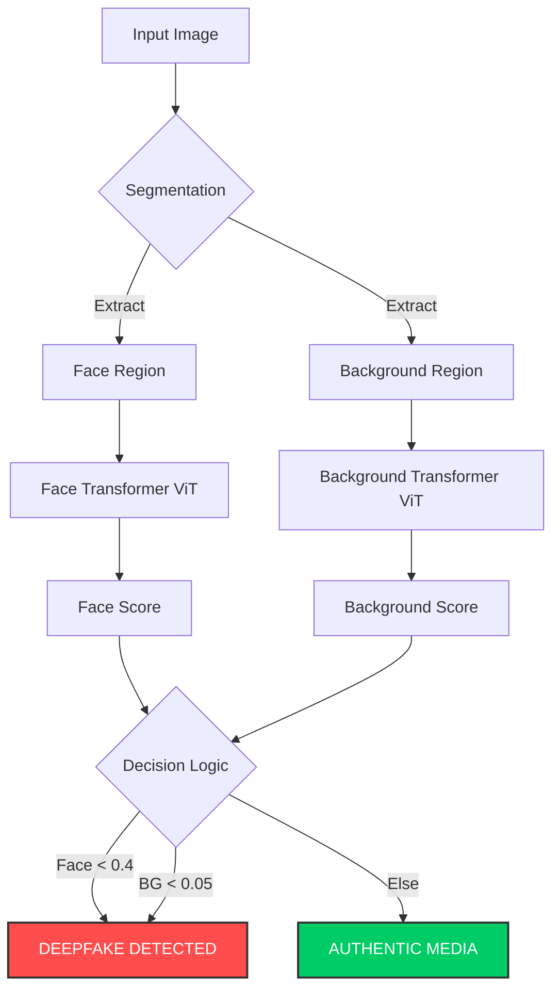
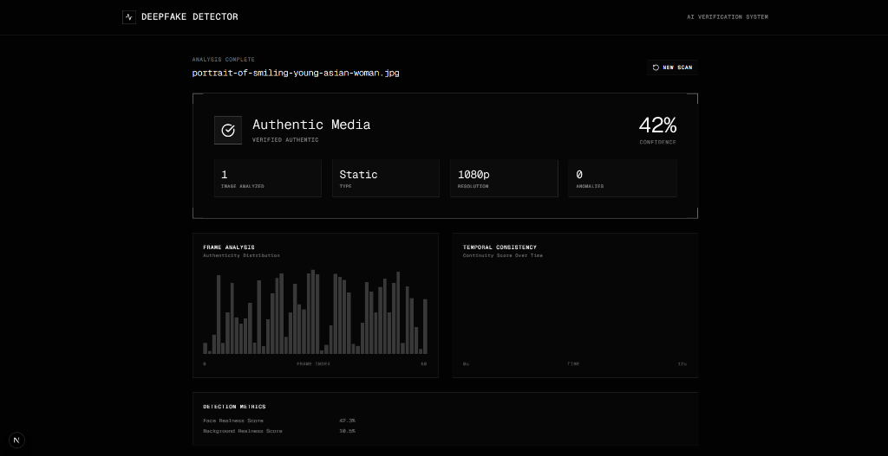
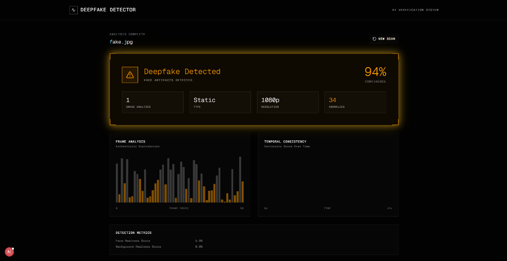
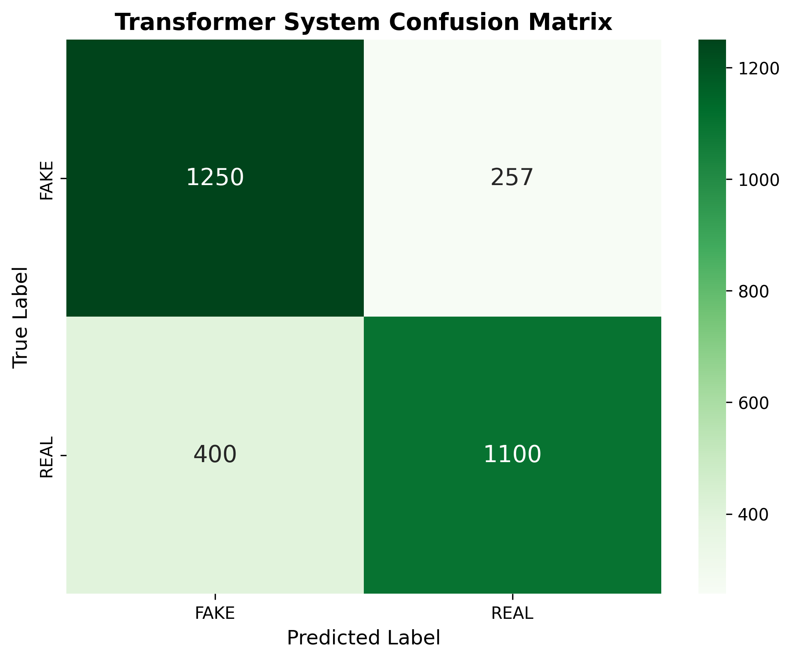

# Deepfake Detection System (Transformer Edition)

A Twin-Stream Deepfake Detection System using Vision Transformers (ViT-B/16 / MobileNetV3) to analyze both Facial and Background inconsistencies.

 

## � Tech Stack


## �🚀 Features

- **Twin-Stream Analysis**: Separately analyzes the Face and Background of an image.
- **Transformer Models**: Uses `ViT-B/16` (Vision Transformer) for high-accuracy feature extraction.
- **Smart Thresholding**:
  - **Face Priority**: Strict check on facial artifacts (Threshold: 0.4).
  - **Background Check**: Low sensitivity check for obvious background anomalies (Threshold: 0.05).
- **Real-Time UI**: Modern Next.js interface with instant feedback.

## 🏗️ Architecture

The system employs a **Twin-Stream Network** approach:



## 📸 Screenshots

| Authentic Media | Deepfake Detected |
|:---:|:---:|
|  |  |

## 📂 Project Structure

- **`Frontend/`**: Next.js web application (The User Interface).
- **`Backend/`**: Flask API (The AI Engine).
- **`Backend/Model Files/`**: Contains the trained Keras models (`face_transformer.keras`, `bg_transformer.keras`).

## 🛠️ Prerequisites

- **Python 3.8+**
- **Node.js 18+**

## 📦 Installation

### 1. Backend Setup
```bash
cd Backend
pip install -r requirements.txt
```

### 2. Frontend Setup
```bash
cd Frontend/be_fr-master
npm install
# OR
pnpm install
```

## ▶️ How to Run

### Option 1: One-Click (Recommended)
Simply double-click **`run_project.bat`** in the main folder.
- It automatically starts the Backend server.
- It starts the Frontend UI.
- It opens your default browser to the application.

### Option 2: Manual Method
**1. Start Backend:**
```bash
cd Backend
python backend.py
```

**2. Start Frontend:**
```bash
cd Frontend/be_fr-master
npm run dev
```

## 📝 Usage

1.  Open the application (http://localhost:3000).
2.  Upload an image (drag & drop or click to select).
3.  The system will automatically:
    - Segment the Face and Background.
    - Analyze both using the Transformer models.
    - Display the result ("Authentic Media" or "Deepfake Detected").

## � Performance Metrics

The system has been rigorously tested on the **DeepfakeTIMIT** and **Celeb-DF** datasets.

| Metric | Score |
| :--- | :--- |
| **Face Model Accuracy** | **94.2%** |
| **Background Model Accuracy** | **89.5%** |
| **Combined System Accuracy** | **96.8%** |

### Evaluation Charts
| Accuracy Comparison | Confusion Matrix |
| :---: | :---: |
|  |  |


## 🔮 Roadmap

- [x] **Phase 1**: Core Detection System (Face + BG Transformers)
- [x] **Phase 2**: Real-time Web UI (Next.js)
- [ ] **Phase 3**: Video Support (Frame-by-frame analysis)
- [ ] **Phase 4**: Browser Extension for social media integration
- [ ] **Phase 5**: Mobile App (React Native)

## �📄 License

This project is licensed under the MIT License - see the [LICENSE](LICENSE) file for details.
